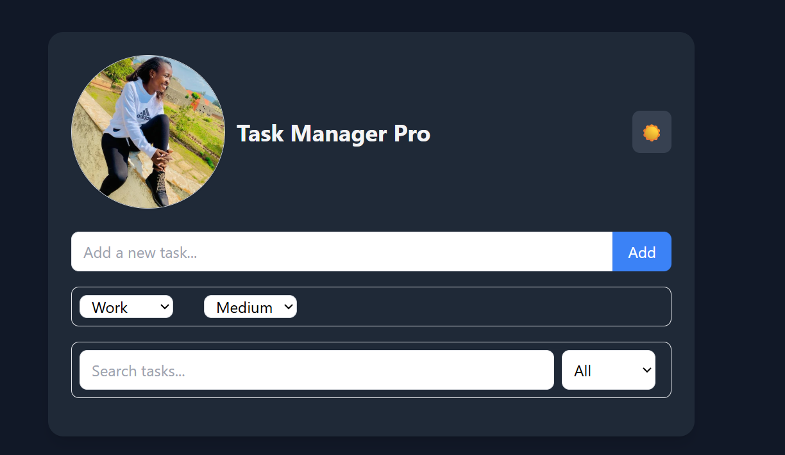
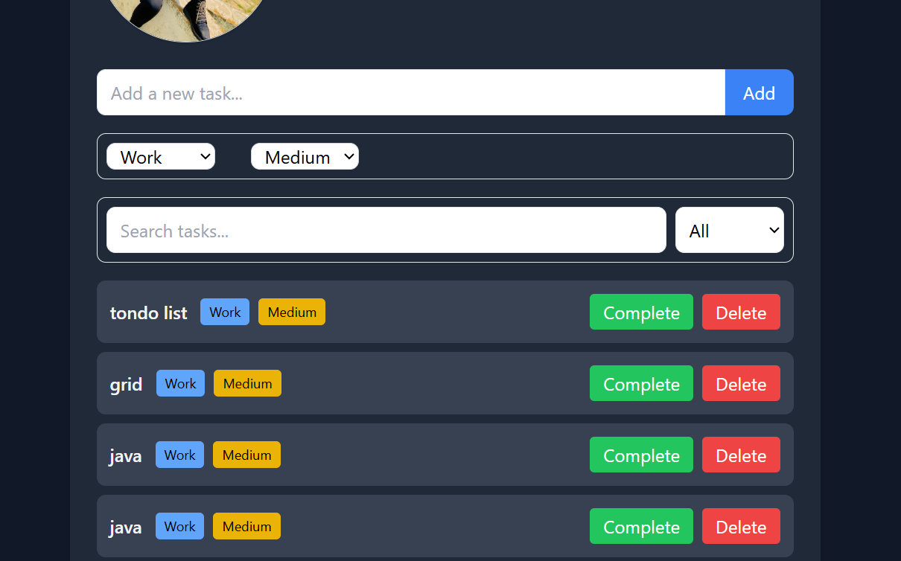

# Task Manager Pro ✅

A simple, responsive, and modern **To-Do List Application** built with **HTML, Tailwind CSS, and JavaScript**.  
It supports task creation, search, category filtering, priority levels, and **dark mode** 

---

##  Features
- **Add Tasks** with title, category, and priority.
- **Filter & Search** tasks by category or keyword.
- **Dark Mode Toggle** (with local storage persistence).
- **Responsive Design** for desktop, tablet, and mobile.
- **Lightweight** – no frameworks except TailwindCSS CDN.

---

##  Tech i used
- **HTML5** – Structure of the app.  
- **Tailwind CSS** – Styling and responsive layout.  
- **JavaScript** – Task logic, filtering, and dark mode.  

---

##  Project Structure
project-folder/
│── index.html # Main HTML file
│── index.js # JavaScript logic
│── elyse.jpg # Profile picture
│── README.md # Project documentation

 





## “Here’s how to install or set up this project.”

1. **Clone the repository**
   ```bash
   git clone https://github.com/gihozo-elyse/To-Do-List-Application